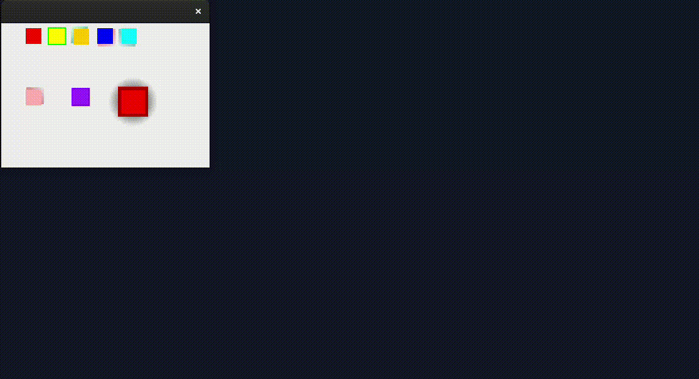
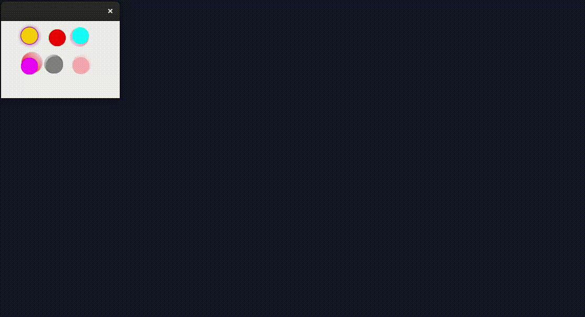

# Test report

## JUnit

### Coverage


Lambda invocation untestable as previously disclosed.

In JCanvas:

```java
protected void paintComponent(Graphics arg0)
```

is untestable as it required a frame and window to be populated. Outside of the execution time of a JUnit test.

### Tests passing


## Visual testing

### Line


### Rectangle



### Circle

